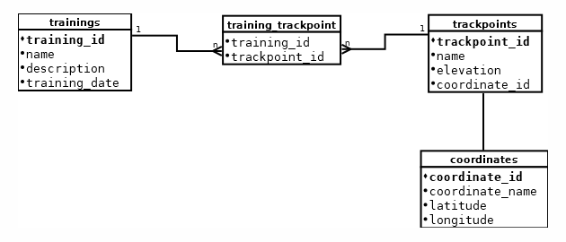

# Alkalmazás futtatása
A projekt egy klasszikus háromrétegű alkalmazást tartalmaz Java Spring backenddel, REST webszolgáltatásokkal, MariaDB 
adatbázissal. Egy futónaplót modellez. Az SQL adatbázis kezelő réteg Spring Data JPA-val van megvalósítva. Az adatbázis
migrációt Flyway végzi. Az alkalmazás működését főleg integrációs tesztekkel (WebClient tesztek) ellenőriztem,
több mint 80%-os lefedettséget értem el. Swagger felület.
A cél egy olyan alkalmazás létrehozása volt, ami
Az alkalmazás három entitásból áll: Coordinate, TrackPoint és Training.

A Coordinate és a TrackPoint között 1-1 kapcsolat van, a TrackPoint és a Training közöt pedig több-több kapcsolat,
ezért a közöttük lévő kapcsolatok felépítéséhez kapcsolótábla szükséges. A programhoz készült adatbázis adatbázis-diagramja ezen
az ábrán látható:



Az alkalmazásunk lebildelése mavennel (a JAR állomány elkészítése):
```shell
mvn clean package 
```

Alkalmazás docker image-nek elkészítése:
```shell
docker build -t image neve .
```

A lebildelt docker image a következő Docker paranccsal indítható:

```shell
docker run -d -e SPRING_DATASOURCE_URL=jdbc:mariadb://vizsgaremek-net-mariadb/vizsgaremek -p 8080:8080 --network vizsgaremek-net spring-vizsgaremek
```

A MariaDB adatbázis elindítása a 3307-es porton a következőképpen történik:
```shell
docker run -d -e MYSQL_DATABASE=vizsgaremek -e MYSQL_USER=remek -e MYSQL_PASSWORD=remek -e MYSQL_ALLOW_EMPTY_PASSWORD=yes -p 3306:3306 --network vizsgaremek-net --name test-mariadb mariadb
```